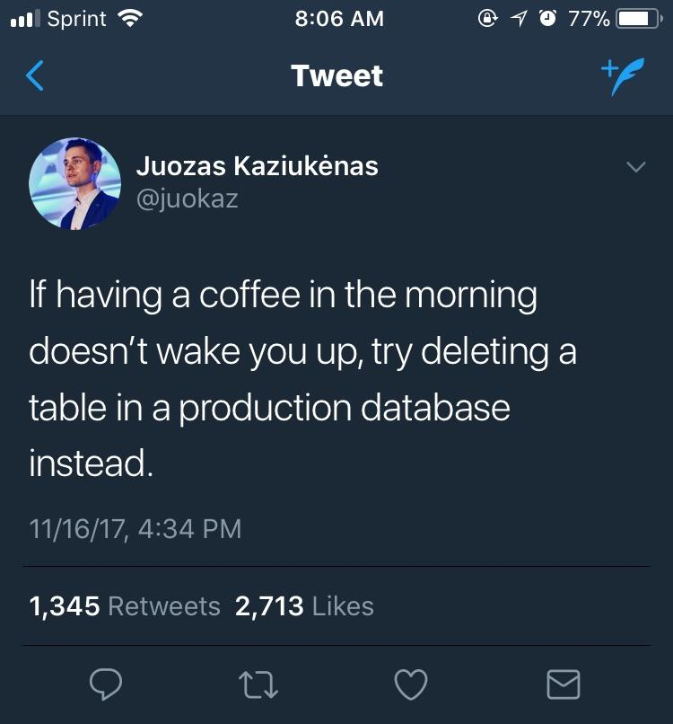

#  An Introduction to MongoDB

## Objectives

By the end of the lesson, students will be able to do the following:

* Define a NoSQL database.
* Select a MongoDB database and collection to work with using the Mongo shell.
* Create, Read, Update, and Destroy documents in a MongoDB collection using the Mongo shell.


## Databases

Databases store our data in a structured way, so we can access what we need when we need it!

The two types of databases we'll learn about in this course are SQL and noSQL.

SQL stands for _"Structured Query Language"_. However, MongoDB is a NoSQL database; this means it's not SQL.

The official terminology is: _not only SQL_.

**_Well what the heck's a SQL database then?_**


## NoSQL Vocabulary - SQL vs NoSQL

Both are considered Databases, but here's the key differences.

- SQL resembles an excel spreadsheet.

- What's normally called a row or record in SQL, is called a document in NoSQL.

- What's normally called a column in SQL, is referred to as a field in NoSQL.

- What's normally called a table in SQL, is called a collection in NoSQL.

- NoSQL resembles JavaScript or JSON Object.
  - It resembles an array like structure with objects containing key pairs.


_As far as SQL databases are concerned, there are several out there. The most common are mySQL, PostgreSQL, and SQLite. They have well defined columns and rows, and they all use some version of the SQL query language_

_Other examples of NoSQL databases are CouchDB, Couchbase, Redis.It. They are all very flexible because their structure involves sets of key-value pairs that can take any shape. Each NoSQL database has its own (very similar) query language._



# Installing MongoDB

Before we do anything with MongoDB, we need to install it.

Installing on macOS:

- First, go to the Mongodb [download center](https://www.mongodb.com/download-center#community).

- Click on the _Community Server_ tab.

- Download the (tgz), or TAR file.

- Open the zip Directory and move the unzipped version to you **user** (home) directory.

  - **NOTE** _If you can't see your user / home directory inside of the finder, once you open the finder, click on preferences and then you should be able to choose what you can see in your sidebar._

- Rename the unzipped directory to `mongo`

- Now, make another (new) folder at the same level in your **user** directory and name it `mongo-data`

- Now, go back to your terminal :sunglasses:

- From the root directory, navigate to your `mongo` directory and then into the `bin` directory from the terminal.
  - `cd ~/mongo/bin`.

- Then to start the `mongo server`, you'll run this command:
  - `./mongod --dbpath ~/mongo-data`

- This command will start up a server and also place some special data files inside of the `mongo-data` directory we just created.

- Now we can open a `mongo` shell by opening another tab in the terminal and navigating to `cd ~/mongo/bin/`:
  - Then run the command: `./mongo`

- Now that we have our `mongoDB Shell` up and running we can create a database!
  - The command for that is very simple `use <DB NAME>`
  - We'll just tell our shell to use the name we want to give our DB.
  - If that DB doesn't exist, MongoDB will create it for us.

- Now we can create a collection and a document inside that collection with one command.
  - `db.<COLLECTION NAME GOES HERE>.insert({text: 'Put some text here'})`

- This command will create a new database collection with whatever you call it, and then it will insert a document called `text`.

- Say we name our collection `Todos`.

  - `db.Todos.insert({text: 'Clean out the refrigerator'})`

  - This command will create a collection: `Todos` and a document inside of the collection: `text`,

- You can then see the document you created as well as any future additional documents by running the following command:
  -  `db.Todos.find()`

### Running this server and shell is a bit tedious right?
Here's your solution for that with `bash` aliases:

- First let's edit your bash profile:
  - Run`atom ~/.bash_profile`:
  - This command should throw your `bash_profile` directly into your atom text editor.
  - Now, just scroll to the bottom of the file and paste these bad boys in: :sunglasses:
```
# Run MongoDB Server:
alias mongodb='cd ~/mongo/bin && ./mongod --dbpath ~/mongo-data'


# Make sure you have the mongodb server running first before running command below:

# Open a Shell in terminal to interface with mongodb
alias mongoshell='cd ~/mongo/bin && ./mongo'
```

This update to our bash profile will tell our `bash` shell to run these commands no matter where we currently are in the terminal.

You **MUST** have your `MongoDB` server running inside it's own tab in your terminal emulator to perform **any** local development or testing.

#### So, to summarize:

**Before Any Development:** Run `mongodb` - This boots up your **MongoDB** server on port 27017.
  - This process must run in a separate tab in your terminal in the background.

**If you need a Mongo Shell** Run `mongoshell` - This will open a shell console to interact with MongoDB directly, just like you're able to interact with your OS from a bash shell. You won't always need a shell, but it's helpful if you ever need to perform tests, or if you don't have a cool UI to interact with your mongoDB.

## Using mongodb with RoboMongo

- First go to and get the [Download](https://robomongo.org/download).

- From the download options, we'll be using the: **_Robo 3T_**.

- Once you'll downloaded it, you can follow the prompted download instructions.

- Open Robo 3T and create a connection to localhost 27017.
  - Click **create**
  - Rename your connection name to **Local Mongo Database**
  - The rest of the fields are set to default values and should already be pre-filled with the correct information

- Now you should be able to see your databases


## More interaction with MongoDB

Although, we just downloaded a super cool GUI for our MongoDb, we still need to get comfortable using a mongo shell

We're going to use a new database to practice with called: **_JobContacts_**

So, to use and create our new database we just run: `use contacts`

The command to list databases is `show databases`

For example:

```
> show databases
local  0.078GB
> use contacts
switched to db contacts
> show databases
local  0.078GB
>
```

Note that although I've switched to the `contacts` database, I haven't put any data into it yet, it doesn't show up in the database list.

The collection we'll create in our database will be called `contacts`. It has no entries in it yet, which you can see by saying `db.contacts.count()`

```
> db.contacts.count()
0
```

This is a common pattern in Mongo: you can refer to anything you like, and Mongo will cooperate, but things are not actually created until you give Mongo something to remember.

## Creating data

We're going to start keeping a contacts database for our job search.

_All these people are fictional, they are products of our imagination, any resemblance to actual persons living or dead is purely coincidental_

Our first contact is Joe Recruiter, with Staffing Inc. So we create his record this way:

```
db.contacts.insert({
    name: 'Joe Recruiter',
    company: 'Staffing Inc.',
    phone: {
        office: '617-555-1991 ext. 311',
        cell: '508-555-9215'
    },
    email: 'joe.recruiter@staffinginc.com'
});
```

MongoDB uses JSON natively, which makes it convenient for Javascript web applications.

Also, the `contacts` database exists now that we have inserted data into it:

```
>  show databases;
contacts  0.078GB
local     0.078GB
>
```

Let's add these people to the contacts database:

&#x1F535; **Activity**
```
- Add the people below to your db
- Thumbs up when done
- 5 minutes
```
Consider the JSON representation first: think before you type!

#### Ann Placement-Manager, Staffing Inc.,
- office phone 617-555-1991 ext. 315,
- cell phone 718-555-9151,
- email ann.placementmanager@staffinginc.com

#### Martine H. R. Manager, TechCorp LLC,
- title Director of Human Resources,
- office phone 617-555-7123,
- cell phone 617-555-9918,
- home phone 617-555-1122,
- work email martine.h.r.manager@techcorpllc.com,
- home email martinemanager@gmail.com


<!--

db.contacts.insert({
    name: 'Ann Placement-Manager',
    company: 'Staffing Inc.',
    phone: {
        office: '617-555-1991 ext. 315',
        cell: '718-555-9151'
    },
    email: 'ann.placementmanager@staffinginc.com'
});

db.contacts.insert({
    name: 'Martine H. R. Manager',
    title: 'Director of Human Resources',
    company: 'TechCorp LLC',
    phone: {
        office: '617-555-7123',
        cell: '617-555-9918',
        home: '617-555-1122'
    },
    email: {
        work: 'martine.h.r.manager@techcorpllc.com',
        home: 'martinemanager@gmail.com'
    }
});

-->

## Retrieving and Reading Data

Let's start by looking at the entire database so far.

```
> db.contacts.find();

{ "_id" : ObjectId("5579a06aaa2cdce4a1f15f21"), "name" : "Joe Recruiter", "company" : "Staffing Inc.", "phone" : { "office" : "617-555-1991 ext. 311", "cell" : "508-555-9215" }, "email" : "joe.recruiter@staffinginc.com" }
{ "_id" : ObjectId("5579a202aa2cdce4a1f15f22"), "name" : "Ann Placement-Manager", "company" : "Staffing Inc.", "phone" : { "office" : "617-555-1991 ext. 315", "cell" : "718-555-9151" }, "email" : "ann.placementmanager@staffinginc.com" }
{ "_id" : ObjectId("5579a20aaa2cdce4a1f15f23"), "name" : "Martine H. R. Manager", "title" : "Director of Human Resources", "company" : "TechCorp LLC", "phone" : { "office" : "617-555-7123", "cell" : "617-555-9918", "home" : "617-555-1122" }, "email" : { "work" : "martine.h.r.manager@techcorpllc.com", "home" : "martinemanager@gmail.com" } }
>
```

That's kind of tough to read, so we can filter it through `.pretty()`

```
> db.contacts.find().pretty();
{
    "_id" : ObjectId("5579a06aaa2cdce4a1f15f21"),
    "name" : "Joe Recruiter",
    "company" : "Staffing Inc.",
    "phone" : {
        "office" : "617-555-1991 ext. 311",
        "cell" : "508-555-9215"
    },
    "email" : "joe.recruiter@staffinginc.com"
}
{
    "_id" : ObjectId("5579a202aa2cdce4a1f15f22"),
    "name" : "Ann Placement-Manager",
    "company" : "Staffing Inc.",
    "phone" : {
        "office" : "617-555-1991 ext. 315",
        "cell" : "718-555-9151"
    },
    "email" : "ann.placementmanager@staffinginc.com"
}
{
    "_id" : ObjectId("5579a20aaa2cdce4a1f15f23"),
    "name" : "Martine H. R. Manager",
    "title" : "Director of Human Resources",
    "company" : "TechCorp LLC",
    "phone" : {
        "office" : "617-555-7123",
        "cell" : "617-555-9918",
        "home" : "617-555-1122"
    },
    "email" : {
        "work" : "martine.h.r.manager@techcorpllc.com",
        "home" : "martinemanager@gmail.com"
    }
}
```

What do we see in this?

* MongoDB gave each of our documents a unique ID field, called ID.

* MongoDB doesn't care that Joe and Ann only have one email, while Martine has two emails.  It also doesn't care that Martine has a job title, while Joe and Ann do not.  

### Searching for particular things

We can pass arguments to `find`, and MongoDB will give us all matching records:

```
> db.contacts.find({ _id: ObjectId("5579a20aaa2cdce4a1f15f23") }).pretty();
{
    "_id" : ObjectId("5579a20aaa2cdce4a1f15f23"),
    "name" : "Martine H. R. Manager",
    "title" : "Director of Human Resources",
    "company" : "TechCorp LLC",
    "phone" : {
        "office" : "617-555-7123",
        "cell" : "617-555-9918",
        "home" : "617-555-1122"
    },
    "email" : {
        "work" : "martine.h.r.manager@techcorpllc.com",
        "home" : "martinemanager@gmail.com"
    }
}


> db.contacts.find({ company: "Staffing Inc." }).pretty();
{
    "_id" : ObjectId("5579a06aaa2cdce4a1f15f21"),
    "name" : "Joe Recruiter",
    "company" : "Staffing Inc.",
    "phone" : {
        "office" : "617-555-1991 ext. 311",
        "cell" : "508-555-9215"
    },
    "email" : "joe.recruiter@staffinginc.com"
}
{
    "_id" : ObjectId("5579a202aa2cdce4a1f15f22"),
    "name" : "Ann Placement-Manager",
    "company" : "Staffing Inc.",
    "phone" : {
        "office" : "617-555-1991 ext. 315",
        "cell" : "718-555-9151"
    },
    "email" : "ann.placementmanager@staffinginc.com"
}
>
```

We got a call from 617-555-1122 called us!  Who could it be?

```
db.contacts.find({ $or: [
    { 'phone': '617-555-1122'},
    { 'phone.office': '617-555-1122' },
    { 'phone.cell': '617-555-1122' },
    { 'phone.home': '617-555-1122' }   
]});
```

There is an incredibly useful table that translates from SQL to MongoDB syntax at [http://docs.mongodb.org/manual/reference/sql-comparison/](http://docs.mongodb.org/manual/reference/sql-comparison/).

## Try it yourself

I recommend working within your groups so that you can assist each other.

&#x1F535; **Activity**
```
- Make up three more fictional people and add them to your contacts database.  
- For now, keep things in the formats we have used with Joe Recruiter, Ann Placement-Manager, and Martine H. R. Director.
- Make sure at least one of your people works for Staffing Inc. or TechCorp LLC.
- Search for your people and make sure you find them in the database!
- 7 minutes
```


## Update

Suppose that Joe Recruiter has spun off his own firm.  We start with finding him in the database:

```
> db.contacts.find({name: "Joe Recruiter"}).pretty();
{
    "_id" : ObjectId("5579a06aaa2cdce4a1f15f21"),
    "name" : "Joe Recruiter",
    "company" : "Staffing Inc.",
    "phone" : {
        "office" : "617-555-1991 ext. 311",
        "cell" : "508-555-9215"
    },
    "email" : "joe.recruiter@staffinginc.com"
}
>
```

Here's how we can update:

```
db.contacts.update({
    name: "Joe Recruiter"
},{ $set: {
    company: 'Recruiter Recruitment LLC',
    'phone.office': '508-555-1111'
}});

db.contacts.update({
    name: "Joe Recruiter"
}, {
    $set: { email: 'joe@recruiterrecruitment.com' }
});
```

(Yes, we could have done both of those in one statement.)

Notice the $set key: the value is a dictionary of key-value pairs to update.

## You try it

* One of the contacts you added got a job at Staffing Inc.  Change his or her company, office phone number, and email.

* One of your contacts has a new job title.  Update it.

## Keeping a record of communications

We're using this database to support a job hunt, right?

```
db.contacts.update({
    name: "Joe Recruiter"
}, {
    $push: { communications: {
        date: '20150611',
        summary: "Discussed General Assembly teaching job" }
    }
});

db.contacts.update({
    name: "Joe Recruiter"
}, {
    $push: { communications: {
        date: '20150612',
        summary: "Discussed General Assembly teaching job further" }
    }
});
```

Joe Recruiter was flagged as a potential case of stolen identity, so we want to remove our contact record:

```
db.contacts.update({
    name: "Joe Recruiter"
}, { $unset: { communications: 1 }});
})
```

## Deleting a document

Joe Recruiter died in 1878. Definitely stolen identity.  No point in keeping him as a contact!

```
db.contacts.remove({ name: "Joe Recruiter"});
```

## Try it yourself

We're starting a veterinary practice to take care of all the cats we know!

&#x1F535; **Activity**
```
Start with `use cats` in your MongoDB shell, then add these cats:


* Tiger, male, age 7, black short hair, adopted from NYSPCA
* Reggie, male, age 7, half-Siamese striped tabby, adopted from NYSPCA
* Ting, seal point Siamese, age 8, male, Siamese rescue
* Boris, male, Russian blue, age 5, brother to Natasha, adopted from NYSPCA


Some cats have favorite pastimes:

* Tiger likes sitting in the sun.
* Reggie likes complaining at the top of his voice.
* Boris likes echolocating in ventilation systems.

```

## How can we use MongoDB with our Express Apps / APIs?
- Let's review our experience with MongoDB, how easy was it to interact with using the MongoShell?

- Perhaps you noticed some "clunkiness" in the MongoDB Shell.

- Some of the queries were not very streamlined either.

- Also, we may have noticed there's no protection against entering arbitrary data.

- MongoDB will literally let us create whatever we want in what ever format we like with very little resistance.

- Application Developers realized this, so they created a library (node_module).
  - This will help us communicate with a MongoDB much better.

- Remember why we have libraries?
  - Think about how the express application framework helps us build an app.
  - Express already comes complete with built in methods to handle http requests, responses.
  - It gives us a listen method that allows us to tell our app to listen on a specific port.
  - Express gives our `node.js` app a form, or structure if you will.
  - Express is like a wrapper that goes on top of `node.js` gives us a generic frame to work with, a frame.

## [Enter Mongoose](http://mongoosejs.com/)
- Mongoose is to MongoDB as Express is to `node.js`.

- Mongoose is an Object Data Mapper (**ODM**).

- Also, unlike how loosely structured our MongoDB was in the shell, Mongoose gives us special objects that allow us to create models and Schemas to structure our data. Similarly to how SQL does.


## Databases and MVC


- Let's add mongoose to an `express` app!

- First, we'll need an app, so let's build one.

- Mongoose is installed like this:
  - `npm install mongoose --save`

- Then you'll need to require it like this:

```js
const mongoose = require('mongoose');
```

- Now we can actually connect to an instance of the MongoDB database like this:
```js
mongoose.connect('mongodb://localhost:27017/TodoApp')
```
- Basically, we're using our mongoose framework/wrapper as a sort of interface or middleware.
  - Mongoose will be like our agent in the background taking functions and turning them into queries.


- Now we'll add mongoose promises:
  - Remember what we learned about promises.

```js
mongoose.Promise = Global.promise;
mongoose.connect('mongodb://localhost:27017/TodoApp');
```

- Promises are native to JavaScript now, and mongoose let's us use them through the process of 'Binding'.

- Now, we're going to set up a mongoose model

```js
const Todo = mongoose.model('Todo', {
  text: {
    type: String
  }
});
```

- Now we can create new instance of our model:

```js

const newTodo = new Todo({
  text: 'Cook Dinner'
});
```

- Now, normally we would set/bind the properties of our Todo model object with the request body, but we're going to do it this way to get the hang of it.

- Let's create mongoose save method to save the new instance of a todo to our database:

```js
  newTodo.save().then((todo) => {
      console.log(todo);
  }, (error) => {
    console.log(error);
  });
```

- Notice how we're using promises here?
  - The `.save()` method actually returns a promise; the `.then()` allows us to handle the success case of that promise; we can also attach an error handler to handle a failure case.

- Based on the way we're written this, once you run `nodemon` inside of the terminal, your save method will automatically save a new instance of the Todo object.

- You can also go to Robo Mongo and see this document created inside of your collection.

- Awesome! We should have created an actual Todo Document inside of our `MongoDB` database.

# Simple Mongoose Queries
So, far we were able to create a document (resource) in a very simple way, let's try some more CRUD methods:

## Read:

The mongoose query method to read all resources is quite simple actually:

```js

// Your GET method route handler '/todos' would start here

Todo.find().then((todos) => {
  console.log(todos);
}, (error) => {
  console.log(error);
});

// Your GET method route handler would finish here
```

All this method does is return a promise to give us all the resources.
Then it will either give us the all the resources or it will give us an error.


## Read by id:

The mongoose query for finding a resource by id again is rather simple:

```js

// Your GET method router handler /todos/:id would start here

let id = req.params.id;

Todo.findById(id).then((todo) => {
  console.log(todo);
}, (error) => {
  console.log(error);
});

// Your GET method router handler /todos/:id would end here
```
All this method does is return a promise to give us one resource, which we specified the search parameters to look for it by ID.

Then it will either give us our resource or it will give us an error.


## Update:

The update mongoose query is one of the most complex queries of them all. However it does slightly resemble how data is updated in the `mongo` shell.

```js

// Your PUT method route '/todos/:id' handler would start here

let id = req.params.id;
let newText = req.body.text

Todo.findByIdAndUpdate(id, {$set: {text: newText}}, {new: true}).then((updatedTodo) => {
  console.log(updatedTodo);
}, (error) => {
  console.log(error);
});
```

Again, this query is slightly more complicated than any of the others we've looked at sp far.

the `.findByIdAndUpdate()` method takes three arguments, the id, an object containing a mongo update operator with another object attached as a value containing the the property key of the document we're updating and the new value we're assigning to it.

Lastly, our final argument allows us to specify what get's returned. This comes in the form of an object with a `new` key with a boolean for it's value. In this case we can have the updated document get returned to us because we've set it to true.

## Delete

Our final query we'll look at today can be used to delete a resource, or document from the database.

```js

// Your DELETE method route `/todos/:id` handler would start here:

let id = req.params;

Todo.findByIdAndRemove(id).then((deletedTodo) => {
  console.log(deletedTodo);
}, (error) => {
  console.log(error);
});


// Your DELETE method route `/todos/:id` handler would start here:


```

Again, this method is pretty straight forward and also very consistent compared to the syntax we've used so far.


Time for the [Lab!](./Monday.md)
<!--
- Now, what happens if we were to initialize a new instance of a `Todo` like this?

  ```js
  const newTodo = new Todo({});
  ```
- Did you notice a document was still created?

```text
  Server is locked and loaded on port 3000
  Saved Todo:  { _id: 5ae4fbf145f21d2549084c12, __v: 0 }
```
- You should have gotten a similar output like this in your terminal.
- You can also go to Robo Mongo and notice a document was created

## [Validators, Types and Defaults are Important.](http://mongoosejs.com/docs/validation.html)
- The mongoose model gives us validation we can use to ensure our data is sanitized before it's created.

```js
const Todo = mongoose.model('Todo', {
  text: {
    type: String,   // Sets the data property to a string.
    required: true, // Sets the data property to required.
    minlentgh: 1,   // Sets a minimum string length.
    trim: true      // This will remove any leading or trailing white space before inserting contents into the databse.

  },
  completed: {
    type: Boolean,
    default: false
  },
  completedAt: {
    type: Number,
    default: null
  }
});
```
#### Now, we can add validation in our model besides just `Type`.
- We can use `required`, which is a boolean we can set to true to prevent the creating of an empty field.
- We can also use `minlength`, which is a string validator to set minimum length.
- We can also set defaults too!

## Now it's time to build our API with RESTful Routing
- The first thing we should do is properly configure our app through the separation of concerns.
- As a best practice, we should put our database configuration inside of a separate file.
  - Inside of the root directory of your project: `mkdir db` and then `touch db/mongoose.js`.
  - We'll add our `mongodb` connection method inside of `mongoose.js` and export it as a module.

  ```js
    // Inside of mongoose.js
    const mongoose = require('mongoose');
    mongoose.Promise = global.Promise;
    mongoose.connect(`mongodb://localhost:27017/Todos`);
    module.exports = {
      mongoose
    }
  ```
  - Then we can require that model inside of our `server.js` file.
  - We could actually set `{mongoose}` as a local variable, which would be assigned the mongoose property from the object that gets returned by requiring the module we created.
    - This is commonly referred to as the process of ES6 de-structuring.

```js

const {mongoose} = require('./db/mongoose')

  // This creates a local variable and sets it equal to the mongoose property from the returned value of the mongoose module
```
#### Now let's separate our models

  _Gotta keep'em seperated_ :sunglasses:
- We'll create another directory called models and place our models inside of it:
  - Inside of the root directory: `mkdir models`
  - Then let's make our model files:
  `touch models/todo.js models/user.js`
  - This command will create two files for both of our models
- Now we can add our models inside of their respective files:

```js

  // inside of user.js

  // we'll need to require mongoose because we're using the the model method that's attached to model
  const mongoose = require('mongoose');

  const User = mongoose.model('User', {
    email: {
      type: String,
      required: true,
      trim: true,
      minlength: 1
    }
  });

  // Don't forget to export it:

  module.exports = {
    User
  }

```

```js

// inside of todo.js

const mongoose = require('mongoose')

const Todo = mongoose.model('Todo', {
  text: {
    type: String // We'll be sure to add our validations later
  },
  completed: {
    type: Boolean
  },
  completedAt: {
    type: Number
  }
});

module.exports = {
  Todo
}


```

- Then, just like we did earlier in our `server.js `file with ES6 destructuring, we'll do that for our other modules:

```js
const {Todo} = require('./models/todo');
const {User} = require('./models/user');
```
  - Again, doing this way will set a local variable and set it equal to the `User` / `Todo` property of the object that gets returned when we require the modules.


## Awesome! Now we can build a creation endpoint to handle POST requests
- However, before we do that, we'll need to install `body-parser`
  - run `npm install body-parser --save`
- By now you should already know that `body-parser` is a middleware that allows us to send `JSON` to the server as a request body.
  - Normally, when a http request body is sent, it's in the form of a string. So, body parser allows us to parse it and turn it into `JSON`
- Now you'll need to require `body-Parser` into your `server.js` file:

    ```js

    // Third Party Modules
    const express = require('express')
    const app = express();
    const morgan = require('morgan');
    const bodyParser = require('body-parser') //  HERE'S WHERE WE'LL REQUIRE IT

    // Local Modules
    const {mongoose} = require('./db/mongoose');
    const {Todo} = require('./models/todo');
    const {User} = require('./models/user');


    // Environment variable
    const port = process.env.PORT || 3000;

    // Middleware
    app.use(morgan('tiny'));


    app.get('/', (req, res) => {
      res.send('Welcome to the homepage')
    });
    app.get('*', (req, res) => {
      res.status(404).sendFile(`${__dirname}/404/404.html`)  
      /* the __dirname variable allows use to reference the absolute file path,
         and this is especially helpful when building an absolute file path to a specific file we need to serve
      */   
    });
    app.listen(port, (err) => {
      console.log(err || `Server is locked and loaded on port ${port}`);
    });
    ```

- Now you'll need to tell your `server.js` script to use `body-parser` as a middleware:

```js

  app.use(bodyParser.json());

```

- Now we can set up a route handler:

```js
app.post('/todos', (req, res) => {
      // We'll add some logic here
})
```
- Remember how for RESTful resource creation, we like to use `/<pluralized resource name>`
- Now let's test our route handler right quick.
  - To do this, we're going to send a request body to the server using `Postman`
  - Go ahead and `console.log(req.body)`.
  - Now, we'll go to `Postman` and select a `POST` request to:
    `localhost:3000/todos`
  - Select the `body tab > raw > JSON`
  - Go ahead and place this object in the input area:

```JSON
{
  "text" : "This is from Postman"
}
```
  - Perfect! We should have gotten seen our terminal print out the request body:

```text
{"text": "This is from Postman"}

```
  - Excellent! Now we can build out our router to actually create some data inside of our database:

```js
  app.post('/todos', (req, res) => {
    let todo = new Todo({
      text: req.body.text
    })
    todo.save().then((doc) => { // remember our promises?
      res.send(doc);
    }, (e) => {
      res.status(400).send(e)
    }) // We can send a response status code back to the user too
  });
```
  - Perfect! Now we should be able to go back to Postman and send another `POST` request and actually create some new data inside of our database!

## Awesome! Now we can build a view all resources endpoint to handle GET requests
- This one will be pretty straight forward after having created a resource already.
- As you may remember, the RESTful route to list all resources would still be pluralized:
  - So, for `todos`, you would write your route like this:
    `/todos`
  - Go ahead and build a route handler to handle this request:

```js
  app.get('/todos', (req, res) => {
    Todo.find().then((todos) => {
      res.send({todos})
        // We'll send todos} as an object, this makes it way more flexible
    }, (e) => {
      res.status(400).send(e)
    })
  })
```
## Excellent! Now we can build an API endpoint to find GET requests to one resource
- There's a couple things mongoose gives us that will make this super easy.
- Let's look at the different ways we can query for one resource.

One way we could locate one resource is to use the `.find()` method.

```js
Todo.find({
  _id: req.body.id
}).then((todo) => {
  res.send(todo)
})
```

If we're trying to find a single resource, this is probably not the best way to do it, especially if the resource cannot be found because it returns an empty array.

Another way we can do this is by using the `.findOne()` method.

```js
Todo.findOne({
  _id: req.body.id
}).then((todo) => {
  res.send(todo);
})
```

This method is slightly more efficient because it's finding one resource by a certain document property. In the case a resource cannot be found, it will return `null`

So, lastly, the best and most efficient way to find a resource (document) inside of a collection, especially when it's by ID is by using the method, `.findById()`. This method will return `null` as well if a resource cannot be found.

```js
Todo.findById(req.body.id).then((todo) => {
  if (!todo) {
    res.send('Sorry, todo was not found')
  }
  res.send(todo)
}, (e) => {
  res.send(e);
})
```


#### So, now that we've explored how to do our queries, we can run this in our app.

This method of finding a todo by id allows us to use a built in class from the MongoDB driver called `ObjectID`. This way we can terminate the function and send back a status is the ID is invalid.


```js
app.get('/todos/:id', (req, res) => {
  let id = req.params.id;
  if (!ObjectID.isValid(id)) {
    return res.status(404).send()
  };
  Todo.findById(id).then((todo) => {
    if (!todo) {
      res.status(404).send()
    };
    res.render('todo', {
      title: 'Todo',
      todo: todo})
  }, (e) => {
    res.status(400).send()
  })
});
```


## Now we can build an API endpoint to delete a resource:

Before we create a delete endpoint for our application, we'll need to get comfortable with the queries first.

First we have the `.remove({})` method. This is an extremely powerful query as it will remove all of the documents in the collection. Using this method in your application is probably not idea, but it's still a good idea to become familiar with it.

Take notice that although this method might resemble the `.find()` method, however this method accepts an empty object as an argument.

So, this is how the `.remove({})` query is written. You can `console.log()` the result, which actually will be the document itself. As you can see, adding mongoose promises make it so much easier to get things done, plus they are very descriptive.


```js
Todo.remove({}).then((success) => {
  console.log(success);
}, (failure) => {
  console.log(failure);
})
/* When we run this command, we'll get a readout like this:
  { n: 2, ok: 1 } this
  This means that two documents were removed and we got a ok property value of 1 meaning success.
  as opposed to a 0
*/

```

The next method we could possibly use is called `findOneAndRemove({})`

This query will find the first document that matches and it will remove it.
One this to keep in mind is that this query actually return the document after it's been removed from the database. This can be useful, if you're trying to give some information back to the user about the document they removed. This method will take an object as an argument because we might be finding the resource by more than just the id.

The next and final mongoose query method we can use is `findByIdAndRemove()`

This query will also return the document to the user just like findOneAndRemove() as you can tell by the naming convention, this query will find by Id first.

This is probably one of the best query methods when deleting a resource by id because it's what it's designed for exactly.

```js

let id = req.params.id;

Todo.findByIdAndRemove(id).then((doc) => {
  console.log(doc);
}, (err) => {
  console.log(err);
});

```

So, for building an API endpoint, we could write our router handler like this:

```js
app.delete('/todos/:id', (req, res) => {
  let id = req.params.id;
  if(!ObjectID.isValid(id)){
  res.status(404).send()
  };

Todo.findByIdAndRemove(id).then((todo) => {
  if(!todo){
    res.status(404).send()
  }
  res.send(todo)
}, (err) => {
  res.status(400).send();
})
});
```

However, when building a UI using a template engine, `a` and `form` elements can only send `GET` and `POST` requests respectively, so this might be an issue we'll have to address.

## Deployment to Heroku!
- Go ahead and create an account with [Heroku](https://signup.heroku.com/), if you haven't already.
  - Heroku is free so don't worry.
First things first, in order to deploy our `node.js` / `express` app to the Heroku, we'll need to configure a few things.

For example, we'll need to configure our database so that we're not using a local instance of MongoDB, and that we're using something a little more practical instead.

Another thing we'll need to address is our environment and port variable.
- We can go ahead and do that now.
```js
const port = process.env.PORT || 3000;

// This is just how Heroku wants us to configure our app
```
- When we make this `or` expression with pipes, Heroku will be able to run our application inside of their own environment and then, for testing, we'll be able to run it locally as well.v

- Then, if you haven't done so already, you'll need to be sure and update your `app.listen()` method:

```js
app.listen(port, () => {
  console.log(`Server is locked and loaded on port ${port}`);
});
```
- When using a template literal string, we can insert the port variable, so we'll get a readout of the actual port or environment we're running on.

- The next detail we'll need to pay attention to is inside of our `package.json` file. We'll need to make sure our start scripts are set up properly.

```json
  "scripts": {
    "test": "echo \"Error: no test specified\" && exit 1",
    "start": "node server.js"
  },

```
    This will be fine as long as the relative file path to your server script file doesn't need to be explicitly notated if you were to run the `node` command from the project's root directory.

- The next area of business to address is to tell heroku which JavaScript runtime engine to use, your version of `node` that this. This ensures you don't run into issues in the future.
  - To specify the version of `node` you're using, you can add an additional property to the JSON object inside of your `package.json` file.


Add an `"engines"` property to your `package.json` file right below your `scripts` property:


  ```json

    "engines":{
       "node": "v8.10.0"  
    }

  ```
So your `package.json` should look like this:

  ```JSON
  {
    "name": "Your Project Name",
    "version": "1.0.0",
    "main": "server.js",
    "scripts": {
      "test": "echo \"Error: no test specified\" && exit 1",
      "start": "node server.js"
    },
    "engines":{
      "node": "v8.10.0"
    },
    "author": "You're Name",
    "license": "ISC",
    },
    "dependencies": {
      "body-parser": "^1.18.2",
      "ejs": "^2.5.9",
      "express": "^4.16.3",
      "mongoose": "^5.0.16",
      "morgan": "^1.9.0"
    }
  }

```
  - Excellent, now we can set up our database!
    - Go to [Heroku Add-On's, ](https://elements.heroku.com/addons) or: https://elements.heroku.com/addons
    - Then search for the `mLab MongoDB` Add-On, or here: https://elements.heroku.com/addons/mongolab
    - `mLab` provides an excellent solution in terms of giving us a virtual instance of `mongoDB` our app can communicate with.
  - First let's install Heroku!

```bash
brew install heroku/brew/heroku
```
  - Now we can test to make sure the install was successful by running:

```bash
heroku --version
```
  - Excellent, now run:

```bash
heroku login
```
  - Enter your email / password and you're all set!
  - Now, if you're ready to deploy, you'll need to create an app instance for heroku first.
    - You can do that using the following command:
```bash
heroku create
```
  - Perfect, you should have an app instance created now! Also, you should have already initialized a `git` repo inside of your project's root directory as well. If you don't have a `git` repo yet, go ahead and create one!
  - You can add your heroku remote by running the command:
```bash
heroku git:remote -a <your heroku app name>
```
  - **If** you're unsure if a heroku remote has been added already, or if you already added a `git` repo prior to running your `heroku create` command. You can check if you have a remote added by running:
```bash
git remote -v
```
    - You should have a readout indicating you've added a heroku remote already.
  - Excellent, now we can tell heroku, that we'd like to add mLab as an AddOn!

    - Let's run the command:
```bash
heroku addons:create mongolab:sandbox
```
    - This command will set the Addon to mLab and choose the sandbox plan for us.
    - Keep in mind that this is **FREE**, however, you might be prompted to enter a credit card in the event of certain circumstances. This is just Heroku's policy, so there's no other way around it.
  - Now you can run the heroku config command to get your heroku configuration variable:
```bash
heroku config
```
    - You should get your configuration variable to printout.
    - Now you'll have one more step to configure your app to ensure it connect to your mLab instance:
      - Go to your databse config file and add the following change:
```js
mongoose.connect(process.env.MONGODB_URI || `mongodb://localhost:27017/Todos`);
```
      - This way, our app can connect to the `MONGODB` environment variable

  - Now, to deploy, all you need to do is run:
```bash
git push heroku master
```
    - Perfect, heroku will respond by reading your scripts and get everything set up configured for you.
    - If you have an issue, you can also run: `heroku logs` to see your log history - if you haven't already gotten familiar with heroku already, this command can print valuable information that can help you debug issues with deployment
  - If you don't have a front-end UI coupled to your app with templates or perhaps a front-end framework like react or angular, you can test your API endpoints with [Postman](https://www.getpostman.com/)! -->
