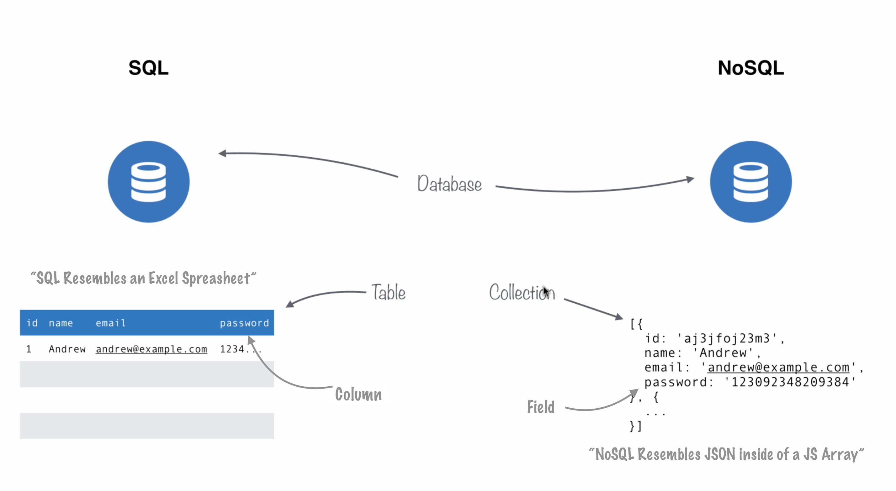

#  An Introduction to MongoDB

## Objectives

By the end of the lesson, students will be able to do the following:

* Define a NoSQL database.
* Select a MongoDB database and collection to work with using the Mongo shell.
* Create, Read, Update, and Destroy documents in a MongoDB collection using the Mongo shell.


## Databases

Databases store our data in a structured way, so we can access what we need when we need it!

The two types of databases we'll learn about in this course are SQL and noSQL.

SQL stands for _"Structured Query Language"_. However, MongoDB is a NoSQL database; this means it's not SQL.

The official terminology is: _not only SQL_.

**_Well what the heck's a SQL database then?_**




## NoSQL Vocabulary - SQL vs NoSQL

Both are considered Databases, but here's the key differences.

- SQL resembles an excel spreadsheet.

- What's normally called a row or record in SQL, is called a document in NoSQL.

- What's normally called a column in SQL, is referred to as a field in NoSQL.

- What's normally called a table in SQL, is called a collection in NoSQL.

- NoSQL resembles JavaScript or JSON Object.
  - It resembles an array like structure with objects containing key pairs.


_As far as SQL databases are concerned, there are several out there. The most common are mySQL, PostgreSQL, and SQLite. They have well defined columns and rows, and they all use some version of the SQL query language_

_Other examples of NoSQL databases are CouchDB, Couchbase, Redis.It. They are all very flexible because their structure involves sets of key-value pairs that can take any shape. Each NoSQL database has its own (very similar) query language._


# Installing MongoDB

Before we do anything with MongoDB, we need to install it.

Installing on macOS:

- First, go to the Mongodb [download center](https://www.mongodb.com/download-center#community).

- Click on the _Community Server_ tab.

- Download the (tgz), or TAR file.

- Open the zip Directory and move the unzipped version to you **user** (home) directory.

  - **NOTE** _If you can't see your user / home directory inside of the finder, once you open the finder, click on preferences and then you should be able to choose what you can see in your sidebar._

- Rename the unzipped directory to `mongo`

- Now, make another (new) folder at the same level in your **user** directory and name it `mongo-data`

- Now, go back to your terminal :sunglasses:

- From the root directory, navigate to your `mongo` directory and then into the `bin` directory from the terminal.
  - `cd ~/mongo/bin`.

- Then to start the `mongo server`, you'll run this command:
  - `./mongod --dbpath ~/mongo-data`

- This command will start up a server and also place some special data files inside of the `mongo-data` directory we just created.

- Now we can open a `mongo` shell by opening another tab in the terminal and navigating to `cd ~/mongo/bin/`:
  - Then run the command: `./mongo`

- Now that we have our `mongoDB Shell` up and running we can create a database!
  - The command for that is very simple `use <DB NAME>`
  - We'll just tell our shell to use the name we want to give our DB.
  - If that DB doesn't exist, MongoDB will create it for us.

- Now we can create a collection and a document inside that collection with one command.
  - `db.<COLLECTION NAME GOES HERE>.insert({text: 'Put some text here'})`

- This command will create a new database collection with whatever you call it, and then it will insert a document called `text`.

- Say we name our collection `Todos`.

  - `db.Todos.insert({text: 'Clean out the refrigerator'})`

  - This command will create a collection: `Todos` and a document inside of the collection: `text`,

- You can then see the document you created as well as any future additional documents by running the following command:
  -  `db.Todos.find()`

### Running this server and shell is a bit tedious right?
Here's your solution for that with `bash` aliases:

- First let's edit your bash profile:
  - Run`atom ~/.bash_profile`:
  - This command should throw your `bash_profile` directly into your atom text editor.
  - Now, just scroll to the bottom of the file and paste these bad boys in: :sunglasses:
```
# Run MongoDB Server:
alias mongodb='cd ~/mongo/bin && ./mongod --dbpath ~/mongo-data'


# Make sure you have the mongodb server running first before running command below:

# Open a Shell in terminal to interface with mongodb
alias mongoshell='cd ~/mongo/bin && ./mongo'
```

This update to our bash profile will tell our `bash` shell to run these commands no matter where we currently are in the terminal.

You **MUST** have your `MongoDB` server running inside it's own tab in your terminal emulator to perform **any** local development or testing.

#### So, to summarize:

**Before Any Development:** Run `mongodb` - This boots up your **MongoDB** server on port 27017.
  - This process must run in a separate tab in your terminal in the background.

**If you need a Mongo Shell** Run `mongoshell` - This will open a shell console to interact with MongoDB directly, just like you're able to interact with your OS from a bash shell. You won't always need a shell, but it's helpful if you ever need to perform tests, or if you don't have a cool UI to interact with your mongoDB.

## Using mongodb with RoboMongo

- First go to and get the [Download](https://robomongo.org/download).

- From the download options, we'll be using the: **_Robo 3T_**.

- Once you'll downloaded it, you can follow the prompted download instructions.

- Open Robo 3T and create a connection to localhost 27017.
  - Click **create**
  - Rename your connection name to **Local Mongo Database**
  - The rest of the fields are set to default values and should already be pre-filled with the correct information

- Now you should be able to see your databases


## More interaction with MongoDB

Although, we just downloaded a super cool GUI for our MongoDb, we still need to get comfortable using a mongo shell

We're going to use a new database to practice with called: **_JobContacts_**

So, to use and create our new database we just run: `use contacts`

The command to list databases is `show databases`

For example:

```
> show databases
local  0.078GB
> use contacts
switched to db contacts
> show databases
local  0.078GB
>
```

Note that although I've switched to the `contacts` database, I haven't put any data into it yet, it doesn't show up in the database list.

The collection we'll create in our database will be called `contacts`. It has no entries in it yet, which you can see by saying `db.contacts.count()`

```
> db.contacts.count()
0
```

This is a common pattern in Mongo: you can refer to anything you like, and Mongo will cooperate, but things are not actually created until you give Mongo something to remember.

## Creating data

We're going to start keeping a contacts database for our job search.

_All these people are fictional, they are products of our imagination, any resemblance to actual persons living or dead is purely coincidental_

Our first contact is Joe Recruiter, with Staffing Inc. So we create his record this way:

```
db.contacts.insert({
    name: 'Joe Recruiter',
    company: 'Staffing Inc.',
    phone: {
        office: '617-555-1991 ext. 311',
        cell: '508-555-9215'
    },
    email: 'joe.recruiter@staffinginc.com'
});
```

MongoDB uses JSON natively, which makes it convenient for Javascript web applications.

Also, the `contacts` database exists now that we have inserted data into it:

```
>  show databases;
contacts  0.078GB
local     0.078GB
>
```

Let's add these people to the contacts database:

&#x1F535; **Activity**
```
- Add the people below to your db
- Thumbs up when done
- 5 minutes
```
Consider the JSON representation first: think before you type!

#### Ann Placement-Manager, Staffing Inc.,
- office phone 617-555-1991 ext. 315,
- cell phone 718-555-9151,
- email ann.placementmanager@staffinginc.com

#### Martine H. R. Manager, TechCorp LLC,
- title Director of Human Resources,
- office phone 617-555-7123,
- cell phone 617-555-9918,
- home phone 617-555-1122,
- work email martine.h.r.manager@techcorpllc.com,
- home email martinemanager@gmail.com


<!--

db.contacts.insert({
    name: 'Ann Placement-Manager',
    company: 'Staffing Inc.',
    phone: {
        office: '617-555-1991 ext. 315',
        cell: '718-555-9151'
    },
    email: 'ann.placementmanager@staffinginc.com'
});

db.contacts.insert({
    name: 'Martine H. R. Manager',
    title: 'Director of Human Resources',
    company: 'TechCorp LLC',
    phone: {
        office: '617-555-7123',
        cell: '617-555-9918',
        home: '617-555-1122'
    },
    email: {
        work: 'martine.h.r.manager@techcorpllc.com',
        home: 'martinemanager@gmail.com'
    }
});

-->

## Retrieving and Reading Data

Let's start by looking at the entire database so far.

```
> db.contacts.find();

{ "_id" : ObjectId("5579a06aaa2cdce4a1f15f21"), "name" : "Joe Recruiter", "company" : "Staffing Inc.", "phone" : { "office" : "617-555-1991 ext. 311", "cell" : "508-555-9215" }, "email" : "joe.recruiter@staffinginc.com" }
{ "_id" : ObjectId("5579a202aa2cdce4a1f15f22"), "name" : "Ann Placement-Manager", "company" : "Staffing Inc.", "phone" : { "office" : "617-555-1991 ext. 315", "cell" : "718-555-9151" }, "email" : "ann.placementmanager@staffinginc.com" }
{ "_id" : ObjectId("5579a20aaa2cdce4a1f15f23"), "name" : "Martine H. R. Manager", "title" : "Director of Human Resources", "company" : "TechCorp LLC", "phone" : { "office" : "617-555-7123", "cell" : "617-555-9918", "home" : "617-555-1122" }, "email" : { "work" : "martine.h.r.manager@techcorpllc.com", "home" : "martinemanager@gmail.com" } }
>
```

That's kind of tough to read, so we can filter it through `.pretty()`

```
> db.contacts.find().pretty();
{
    "_id" : ObjectId("5579a06aaa2cdce4a1f15f21"),
    "name" : "Joe Recruiter",
    "company" : "Staffing Inc.",
    "phone" : {
        "office" : "617-555-1991 ext. 311",
        "cell" : "508-555-9215"
    },
    "email" : "joe.recruiter@staffinginc.com"
}
{
    "_id" : ObjectId("5579a202aa2cdce4a1f15f22"),
    "name" : "Ann Placement-Manager",
    "company" : "Staffing Inc.",
    "phone" : {
        "office" : "617-555-1991 ext. 315",
        "cell" : "718-555-9151"
    },
    "email" : "ann.placementmanager@staffinginc.com"
}
{
    "_id" : ObjectId("5579a20aaa2cdce4a1f15f23"),
    "name" : "Martine H. R. Manager",
    "title" : "Director of Human Resources",
    "company" : "TechCorp LLC",
    "phone" : {
        "office" : "617-555-7123",
        "cell" : "617-555-9918",
        "home" : "617-555-1122"
    },
    "email" : {
        "work" : "martine.h.r.manager@techcorpllc.com",
        "home" : "martinemanager@gmail.com"
    }
}
```

What do we see in this?

* MongoDB gave each of our documents a unique ID field, called ID.

* MongoDB doesn't care that Joe and Ann only have one email, while Martine has two emails.  It also doesn't care that Martine has a job title, while Joe and Ann do not.  

### Searching for particular things

We can pass arguments to `find`, and MongoDB will give us all matching records:

```
> db.contacts.find({ _id: ObjectId("5579a20aaa2cdce4a1f15f23") }).pretty();
{
    "_id" : ObjectId("5579a20aaa2cdce4a1f15f23"),
    "name" : "Martine H. R. Manager",
    "title" : "Director of Human Resources",
    "company" : "TechCorp LLC",
    "phone" : {
        "office" : "617-555-7123",
        "cell" : "617-555-9918",
        "home" : "617-555-1122"
    },
    "email" : {
        "work" : "martine.h.r.manager@techcorpllc.com",
        "home" : "martinemanager@gmail.com"
    }
}


> db.contacts.find({ company: "Staffing Inc." }).pretty();
{
    "_id" : ObjectId("5579a06aaa2cdce4a1f15f21"),
    "name" : "Joe Recruiter",
    "company" : "Staffing Inc.",
    "phone" : {
        "office" : "617-555-1991 ext. 311",
        "cell" : "508-555-9215"
    },
    "email" : "joe.recruiter@staffinginc.com"
}
{
    "_id" : ObjectId("5579a202aa2cdce4a1f15f22"),
    "name" : "Ann Placement-Manager",
    "company" : "Staffing Inc.",
    "phone" : {
        "office" : "617-555-1991 ext. 315",
        "cell" : "718-555-9151"
    },
    "email" : "ann.placementmanager@staffinginc.com"
}
>
```

We got a call from 617-555-1122 called us!  Who could it be?

```
db.contacts.find({ $or: [
    { 'phone': '617-555-1122'},
    { 'phone.office': '617-555-1122' },
    { 'phone.cell': '617-555-1122' },
    { 'phone.home': '617-555-1122' }   
]});
```

There is an incredibly useful table that translates from SQL to MongoDB syntax at [http://docs.mongodb.org/manual/reference/sql-comparison/](http://docs.mongodb.org/manual/reference/sql-comparison/).

## Try it yourself

I recommend working within your groups so that you can assist each other.

&#x1F535; **Activity**
```
- Make up three more fictional people and add them to your contacts database.  
- For now, keep things in the formats we have used with Joe Recruiter, Ann Placement-Manager, and Martine H. R. Director.
- Make sure at least one of your people works for Staffing Inc. or TechCorp LLC.
- Search for your people and make sure you find them in the database!
- 7 minutes
```


## Update

Suppose that Joe Recruiter has spun off his own firm.  We start with finding him in the database:

```
> db.contacts.find({name: "Joe Recruiter"}).pretty();
{
    "_id" : ObjectId("5579a06aaa2cdce4a1f15f21"),
    "name" : "Joe Recruiter",
    "company" : "Staffing Inc.",
    "phone" : {
        "office" : "617-555-1991 ext. 311",
        "cell" : "508-555-9215"
    },
    "email" : "joe.recruiter@staffinginc.com"
}
>
```

Here's how we can update:

```
db.contacts.update({
    name: "Joe Recruiter"
},{ $set: {
    company: 'Recruiter Recruitment LLC',
    'phone.office': '508-555-1111'
}});

db.contacts.update({
    name: "Joe Recruiter"
}, {
    $set: { email: 'joe@recruiterrecruitment.com' }
});
```

(Yes, we could have done both of those in one statement.)

Notice the $set key: the value is a dictionary of key-value pairs to update.

## You try it

* One of the contacts you added got a job at Staffing Inc.  Change his or her company, office phone number, and email.

* One of your contacts has a new job title.  Update it.

## Keeping a record of communications

We're using this database to support a job hunt, right?

```
db.contacts.update({
    name: "Joe Recruiter"
}, {
    $push: { communications: {
        date: '20150611',
        summary: "Discussed General Assembly teaching job" }
    }
});

db.contacts.update({
    name: "Joe Recruiter"
}, {
    $push: { communications: {
        date: '20150612',
        summary: "Discussed General Assembly teaching job further" }
    }
});
```

Joe Recruiter was flagged as a potential case of stolen identity, so we want to remove our contact record:

```
db.contacts.update({
    name: "Joe Recruiter"
}, { $unset: { communications: 1 }});
})
```

## Deleting a document

Joe Recruiter died in 1878. Definitely stolen identity.  No point in keeping him as a contact!

```
db.contacts.remove({ name: "Joe Recruiter"});
```

## Try it yourself

We're starting a veterinary practice to take care of all the cats we know!

&#x1F535; **Activity**
```
Start with `use cats` in your MongoDB shell, then add these cats:


* Tiger, male, age 7, black short hair, adopted from NYSPCA
* Reggie, male, age 7, half-Siamese striped tabby, adopted from NYSPCA
* Ting, seal point Siamese, age 8, male, Siamese rescue
* Boris, male, Russian blue, age 5, brother to Natasha, adopted from NYSPCA


Some cats have favorite pastimes:

* Tiger likes sitting in the sun.
* Reggie likes complaining at the top of his voice.
* Boris likes echolocating in ventilation systems.

```

## How can we use MongoDB with our Express Apps / APIs?
- Let's review our experience with MongoDB, how easy was it to interact with using the MongoShell?

- Perhaps you noticed some "clunkiness" in the MongoDB Shell.

- Some of the queries were not very streamlined either.

- Also, we may have noticed there's no protection against entering arbitrary data.

- MongoDB will literally let us create whatever we want in what ever format we like with very little resistance.

- Application Developers realized this, so they created a library (node_module).
  - This will help us communicate with a MongoDB much better.

- Remember why we have libraries?
  - Think about how the express application framework helps us build an app.
  - Express already comes complete with built in methods to handle http requests, responses.
  - It gives us a listen method that allows us to tell our app to listen on a specific port.
  - Express gives our `node.js` app a form, or structure if you will.
  - Express is like a wrapper that goes on top of `node.js` gives us a generic frame to work with, a frame.
  - Very soon, we'll learn about Mongoose.js; a library that allows out express apps to interface with MongoDB.